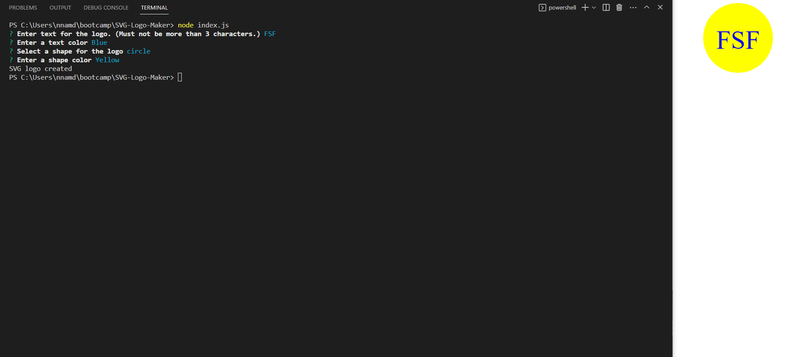

# SVG-Logo-Maker

## Description

## Table of Contents

- [Screenshots](#Screenshots)

- [Installation](#installation)

- [Usage](#usage)

- [License](#license)

- [Contributing](#contributing)

- [Tests](#tests)

- [Demo Video Link](#demo-video-link)

- [Questions](#questions)

## Screenshots

## Installation

To install the necessary dependencies, run 'npm i' in the terminal.

## Usage

To use the application after installing the necessary dependencies, run 'node index.js' in the terminal.

## License

The license being used for this application is the MIT license.

## Contributing

N/A

## Tests

Run 'npm run tests' in the terminal to perform the tests for this application.

## Demo Video Link

https://youtu.be/9qRQmPrhYtw

## Questions

If you have any questions feel free to reach out to me at my email nnamdionyeije@gmail.com or through my GitHub at [https://github.com/nnamdionyeije](https://github.com/nnamdionyeije/).
